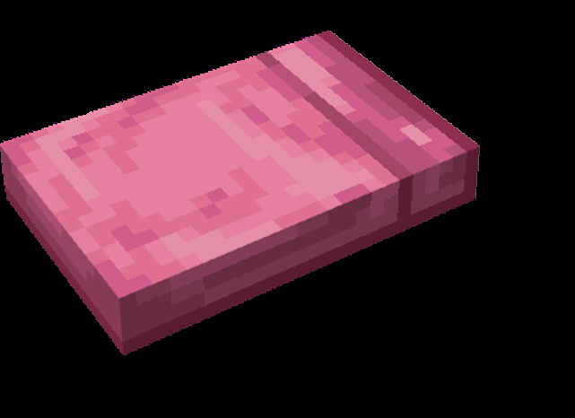

# OpenCV 颜色分割

该项目是OpenCV颜色分割实现的一个测试，将下图的床的图片中的粉色单独提取出来

## 实现思路

通过提取粉色的hsv掩码，将图片中的粉色单独提取出来

掩码如下所示：

| hsv | 下界 | 上界 |
| :-: | :--: | :--: |
|  h  | 150 | 200 |
|  s  |  0  | 255 |
|  v  |  0  | 255 |

实现效果如下图

